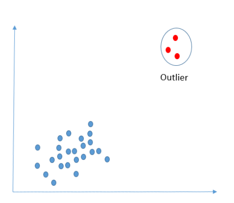

# School of Computing &mdash; Year 4 Project Proposal Form

## SECTION A

|                     |                   |
|---------------------|-------------------|
|Project Title:       | Anomaly detection using different data-mining techniques            |
|Student 1 Name:      | Shannon Mulgrew   |
|Student 1 ID:        | 16304263            |
|Student 2 Name:      | Sian   Lennon         |
|Student 2 ID:        | 16343896            |
|Project Supervisor:  | Mark Roantree            |

## SECTION B

### Introduction

Our proposed project is a data-mining based research/software project specifically focusing on anomaly detection. The project will investigate the usefulness of different anomaly detection techniques for a number of different datasets. From this investigation, we will create a system that can apply these methods to an 'unseen' dataset and give insights into the outliers within the given dataset provided they exist.

### Outline

For this project, we have multiple goals in mind. The main goal of the project is to create and apply a number of anomaly detection algorithms using various techniques on different datasets. The purpose of this is to gain insights into the different methods that we have applied. An example of this would be, why a particular method highlights certain outliers whereas another displays differnt outliers or even no outliers at all.

**Anomaly Example**

  

  

Although it is to be further confirmed, we plan on using 4 techniques. Two density-based technique such as; k-nearest neighbor, local outlier factor, isolation forests.
One cluster analysis algorithm, looking for bursts of outlying activity. And finally a Bayesian Networks approach.

The datasets we plan on using are also not locked down. However, we would like to use 10 separate datasets that differ in structure to get the best result. Such as one possibly on card transactions in the realm of fraud detection, one on health-care to point out any faults and one on environmental issues to point out unusual activity.
The steps that will need to be undertaken are choosing a particular dataset, cleaning it and applying our algorithms to it in order to obtain results.
Once the algorithms have been developed and applied to the datasets, the next step would be analysis. We will prepare a report of our findings based on the results gathered from running the algorithms over our datasets. Our goal is to be able to say which algorithm worked well with which dataset and why as well as reporting any findings we did not anticipate and explaining our understanding of this.
 

The last step would be to make an application to allow users to upload a dataset of there own. The application will run the dataset over our algorithms and produce a graph of the anomalies detected for each method. We will then display the 'best-fit' method used along with the results based on our previous findings from the above experiments. For example, which method worked well and why? The why part will be deduced from our experiments. Done by, comparing and contrasting the dataset given and the results from this to the datasets used in the experiments and their results.
The application will will feature a basic UI and backend to handle the datasets and display a graphical representation on the results.

  

### Background

The idea for this project first arose when brainstorming ideas for the project together. We both had similar interests in particular areas but liked the idea of doing a data-mining project as it is an area we found to be most interesting and appealing. Although we are interested in this field it is sort of new to us but our interest has driven us to learn more about it and base our project in this area.

While researching project ideas in the area of data mining we came across anomaly detection and realised it is a huge area within data-analytics. It is widely used for fraud detection, fault detection and outlining anything that differs from the norm. We believe anomaly detection to be a very important part of data-mining as it offers just as much information as insights from ‘normal’ data.

We then began looking into what we could do with this, we became aware that there are multiple techniques used for anomaly detection and finding the best one for each data-set can be time consuming and troubling. 

This is when we decided on creating different anomaly detection algorithms based on different techniques. We could then test these techniques on multiple data-sets to possibly find the ‘right’ technique. This is how this research based project idea came about.

### Achievements

The main function of this project is to gain an insight into the different anomaly detection techniques. We believe that conducting these experiments can outline which algorithm is best suited to which particular dataset. We then want to understand **why** an algorith suits a particular dataset or alternatively **why** it does not. This could be down to the structure of the dataset or other factors such as the type of data (numerical, categorical etc.).
By creating the interactive application, we plan to provide a way to process a dataset and then detect which algorithm is best-suited and explain why.

### Justification

Anomaly detection is used to find outliers in datasets. It finds rare items, observations or events that raise suspicion and how they differ significantly from the rest of the data. So why is anomaly detection useful? Anomalies in data can often suggest issues such as bank fraud, medical problems, structural defects or even errors in text. As well as using anomaly detection to avoid financial loss it can be applied to many areas regarding healthcare, environmental studies and political research. Insights from data are very useful and important nowadays as we live in a data driven era. The anomalies that can be pointed out are just as useful as normal insights.
Anomaly detection is used in many different areas including:

  

  

Our plan is to research the different techniques used for anomaly detection and show what techniques should be used for which data sets depending on their structure and data type. As well as presenting our results for each dataset we need to understand why a particular algorithm worked well for one but not another and this understanding would be very useful in the world of data-science.

 

Many different companies accross the globe use anomaly detection for a variety of reasons. If the wrong technique is used, this can cause problems for the company as many anomalies can be missed/wrongly detected. Our project will detect the correct method needed and will prevent damages such as this from happening.
This could greatly benefit the area as it would improve the accuracy of anomaly detection. This would mean that anomalies such as bank fraud or medical issues could be spotted with more ease and care.

 

As an added bonus to the justification of our project, anyone looking to find anomalies in their dataset can upload their dataset to our application. It will not only find the anomalies, but it will tell you which method worked best and explain the reasoning behind it. Therefore, it could also be used by data-scientists or people interested in the area.

### Programming language(s)

- Python
- SQL
- HTML
- CSS
- JavaScript
- Markdown

### Programming tools / Tech stack

- Jupyter notebooks - Web app for creating docs. Good for data-mining. 
- Pandas - library for data structures.
- MySQL - Database management.
- Visual studio - text editor.
- Selenium - Testing.
- Django - Framework.
- Boostrap - Library.

### Learning Challenges

The nature of this project is research based meaning we are expecting to succeed with our analysis but also find unexpected results that may hinder our progress. However we hope to learn from these and use them to our advantage.

New Tech:

- Jupyter notebook: A open-source web app for creating and sharing documents. The notebooks will be very useful for equations and visulizations and also for sharing the notebooks between us.
- Statistical modeling: Statistical modeling such as this, is a new concept for us and will be a challenge to learn.
- Database management/MySQL: As we will be using datasets, MySQL will be needed.
- SQL: SQL will be needed for the above also.

### Breakdown of work

Our strategy is to split the work down the middle. Taking two methods of outlier detection each and runnning the datasets over them. Next we will gather all results, compare and contrast with eachother and document them in a format that can be accessed from the application.
The aplication will be split backend and front end. Any other work that arises will be split as well as the documentation.

#### Student 1: Shannon

1. Pick method for anomaly detection.
2. Create algorithm for specific technique.
3. Repeat for all datasets, recording the outcome for each.
4. Compare and contrast the results for each dataset.
5. Prepare a report on this method.
6. Repeat above for next method.
7. Gather all results.
8. Work on frontend of application.
9. Set up database for application. Used for storing our results for research.
10. Testing.

#### Student 2: Sian

1. Pick method for anomaly detection.
2. Create algorithm for specific theqnique.
3. Repeat for all datasets, recording the outcome for each.
4. Compare and contrast the results for each dataset.
5. Prepare a report on this method.
6. Work on last method in correlation with other student.
7. Gather all results.
8. Work on back-end of application.
9. Testing.

